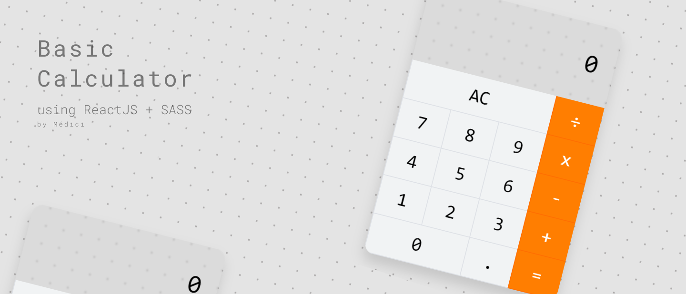
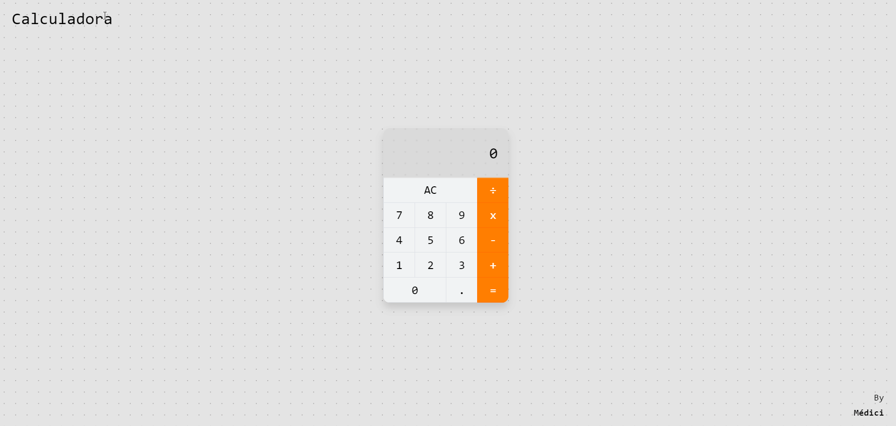

<h1 align="center">
  
</h1>


# Calculator with ReactJS :rocket: 
---
This project was created using basics principles of React JS and SASS. Developed during the course: Web Modern + Javascript by [Leonardo Leitão.](https://github.com/leonardomleitao)
The design of the calculator was mainly inspired by the native of the Mac system, with minor modifications in the background and colors

<p align="center">
  
  
</p>

<p align="center">
  <a href="#demo-calculator">Calculator</a>&nbsp;&nbsp;&nbsp;|&nbsp;&nbsp;&nbsp;
  <a href="#camera-images">Images</a>&nbsp;&nbsp;&nbsp;|&nbsp;&nbsp;&nbsp;
  <a href="#information_source-how-to-use">How To Use</a>&nbsp;&nbsp;&nbsp;
</p>

## Demo Calculator 
🚧 Still missing the link for demo! 🚧

## :camera: Images
<p align="center">
  
</p>

## :information_source: How To Use

To clone and run this application, you'll need [Git](https://git-scm.com), [Node.js v10.16][nodejs] or higher installed on your computer. From your command line:

```bash
# Clone this repository
$ git clone https://github.com/ItaloMedici/calculadora-react.git 

# Go into the repository
$ cd calculadora-react

# Install dependencies
$ npm install

# Run the app
$ npm start

# Acess the localhost
http://localhost:3000/

```
---

Made with ♥ by Ítalo Médici :wave: [Get in touch!](https://www.linkedin.com/in/%C3%ADtalo-m%C3%A9dici-070336186/)
<p align="center" style="font-size: 12px">never stop learning!</p>